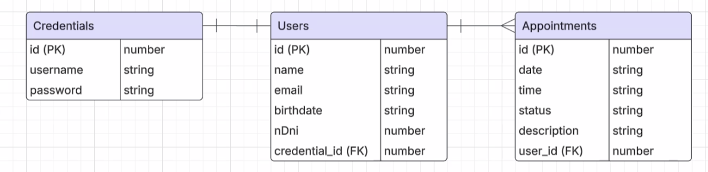

# User Stories

- Como usuario Invitado quiero...
1. Ingresar al Home para ver contenido y dinámica de la página.
2. Poder registrarme y crear una nueva cuenta.

- Como Usuario Registrado quiero...
1. Iniciar sesión con mis credenciales.
2. Cerrar sesión.
3. Reservar turnos.
  - Elegir fecha, hora y descripción
  - Recibir email (Extra Credit)
4. Cancelar un turno.
  - Hasta un día antes del turno.
  - Recibir un email (Extra Credit)
5. Reagendar (Extra Credit)
6. Visualizar listado de mis turnos reservados y cancelados.
7. Poder modificar mi foto de perfil (Extra Credit)

  - Como Admin. (Extra Credit)
1. Banear usuarios-
2. Cancelar turnos.
3. Crear contenido.

# UX/UI

- Landing page de bienvenida.
- Home con información.
- Formulario de Registrado, Login y Reserva de turno.
 - Intuitivo, con validaciones y que no se reinicie.
- Agradable y a la vista.
- Que brinde respuestas.

# Diagrama Entidad-Relación
